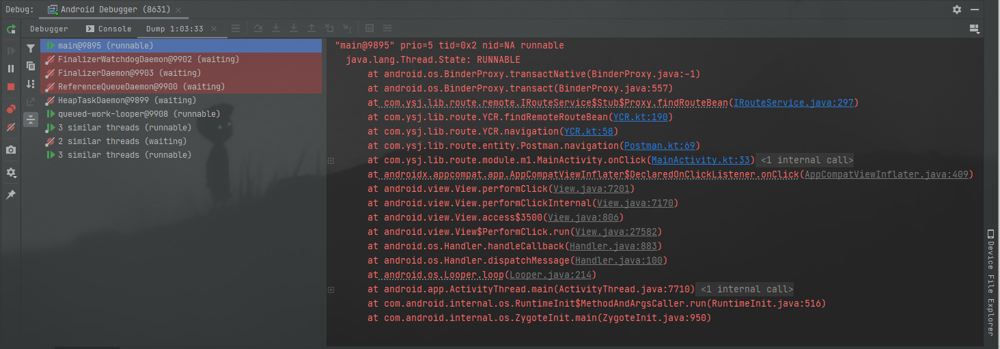

## YCR —— YComponentRouter

[](https://kotlinlang.org)  

YCR 是一个轻量级的，支持跨进程调用的，支持渐进式改造的组件化框架。

YCR 的设计初衷在于减少项目的组件化改造成本。框架整体采用贴近原生的设计思路，在尽可能保留原生能力上做扩展，以最大程度的保留兼容性和扩展性。

YCR 的整体设计和调用方式和 [*ARouter*](https://github.com/alibaba/ARouter) 类似，如果你之前采用的是 ARouter 方案，相信你很快就能上手。YCR 也继承了 [*CC*](https://github.com/luckybilly/CC) 渐进式组件化的思想，提供了行为处理器用于处理组件间的交互行为，使新组件的开发不再必须要老项目提前解耦或下沉公共类，并且提供了跨进程调用能力使新组件的开发更加便捷。


#### 功能&进度

- [x] 页面，拦截器，行为处理器等组件自动注册
- [x] 支持组件间行为调用，支持夸组件获取任意对象
- [x] 支持开发时跨进程组件调用
- [x] 支持路由过程拦截器
- [x] 支持绑定 Lifecycle 控制路由过程的生命周期
- [x] 支持 startActivityForResult
- [x] 支持调用过程无入侵式获取 ActivityResult
- [ ] 支持原生跳转动画
- [x] 支持目标 Activity 路由参数注入
- [x] 支持 Kotlin，Java 混编
- [x] 支持自定义局部的路由过程的异常处理，处理后可选择是否抛到全局
- [x] 支持自定义全局的路由过程的异常处理
- [x] 在集成化打包时去除 remote 相关代码，不影响 App 启动过程


### 如何构建

#### 1.了解项目结构

- YCR
  - app —— 主组件 demo
  - lib_base —— 组件基础库 demo
  - module_m1 —— kotlin 的业务组件 demo 
  - module_java —— java 的业务组件 demo
  - repos —— YCR 库的本地 maven 仓库，便于开发时调试和构建
  - libs —— YCR 库的源码目录
    - lib_ycr_annoation —— YCR 库所用的注解和路由基础实体
    - lib_ycr_apt —— YCR 库的注解处理器
    - lib_ycr_plugin —— YCR 库的插件，用于自动注册路由，拦截器等
    - lib_ycr_api_core —— YCR 库 Api 的核心，用于实现 lib_ycr_api 和 lib_ycr_api_dev
    - lib_ycr_api —— YCR 库的集成时 Api
    - lib_ycr_api_dev —— YCR 库的开发时 Api（用于开发时跨进程调用）

#### 2.在构建前先在项目根目录下执行该命令保持本地仓库应用最新的源码

- ./gradlew uploadArchives


### 如何使用

#### 页面路由

```java
// 通过 @Route 标记 Activity 即可实现页面间路由
@Route(path = "/test/activity")
public class YourActivity extend Activity {
    ...
}
```

#### 参数注入

```java
public class YourActivity extends Activity {

    @RouteParam
    int i;
    @RouteParam
    boolean b;
    @RouteParam
    String str;
    // 通过 name 手动指定 key
    @RouteParam(name = "name")
    String aaa;

    @Override
    protected void onCreate(@Nullable Bundle savedInstanceState) {
        super.onCreate(savedInstanceState);
        // 通过该代码标记该类需要注入
        YCR.getInstance().inject(this);
    }
}
```

#### 行为处理器

```java
// 通过 @Route 标记 IActionProcessor 的实现类来定义一个行为处理器
@Route(path = "/test/actions")
public class YourActionProcessor implements IActionProcessor {
    @Nullable
    @Override
    public Object doAction(@NotNull Postman postman) {
        // 在这里处理
        switch (postman.getActionName()) {
            case "your_action":
                return "any object";
        }
        return null;
    }
}
```

#### 拦截器

```java
// 通过实现 IInterceptor 接口来定义一个拦截器
public class YourInterceptor implements IInterceptor {
    
    @Override
    public void priority() { 
        // 定义拦截器的优先级，拦截器会按照该优先级顺序执行
        // 优先级可以相同，但是相同的优先级不保证执行顺序
        return 1;
    }

    @Override
    public void onIntercept(@NotNull Postman postman, 
                            @NotNull InterceptorCallback interceptorCallback) {
		// 表示该拦截器允许继续后续的路由
        interceptorCallback.onContinue(postman);
        // 表示该拦截器不允许后续路由，并中断后续拦截器
        // 你可以通过 InterruptReason 来告诉路由调用方中断路由的原因
        interceptorCallback.onInterrupt(postman, new InterruptReason<>(1, "", null));
    	// 注意此处 onContinue 和 onInterrupt 必须调用其中一个，但不能都调用
    }
}
```

#### 给 YCR 提供自定义的 ThreadPoolExecutor

```java
// 你可以通过实现 IExecutorProvider 来为 YCR 提供一个 ThreadPoolExecutor
// 但这不是必须的，YCR 有自己默认的线程池（单线程）
// 在一个 app 中只能有一个 IExecutorProvider 实现，否则会在编译时提示错误
public class YourExecutorProvider implements IExecutorProvider {
    @Nullable
    @Override
    public ThreadPoolExecutor providerExecutor() {
        // 在这里返回你自己的线程池
        // 若返回 null 时 YCR 会使用自己默认的线程池
        return (ThreadPoolExecutor) Executors.newCachedThreadPool();
    }
}
```

#### API 演示

YCR 支持流式调用 API，你可以在一行代码中完成组件间调用

```java
// 路由到 @Route(path = ""/app/MainActivity"") 标识的 Activity 中
YCR.getInstance().build("/app/MainActivity").navigation(context)

// 路由过程绑定生命周期，当生命周期状态变更为 Lifecycle.State.DESTROYED 时会中断路由过程
YCR.getInstance()
    .build("/app/MainActivity")
    .bindLifecycle(lifecycle)
    .navigation(context)

// 路由时携带参数（如下为传递整个 Bundle）
Bundle params = new Bundle();
YCR.getInstance()
    .build("/app/MainActivity")
    .withAll(params)
    .navigation(context)

// 路由时 Activity 时指定 requestCode，此时 Context 需为 Activity 才能生效
YCR.getInstance()
    .build("/app/MainActivity")
    .withRequestCode(100)
    .navigation(context)
    
// 路由到 @Route(path = "/app/actions") 标识的 IActionProcessor 中
// 并执行 app_test_action 行为
YCR.getInstance()
    .build("/app/actions")
    .withRouteAction("app_test_action")
    .navigation(context)

// 同步调用行为并获取返回结果
Object result = YCR.getInstance()
	.build("/m1/actions")
	.withRouteAction("m1_test_action1")
    .navigationSync(context)
    
// 添加路由结果的监听
YCR.getInstance()
    .build("/app/actions")
    .withRouteAction("app_test_action")
    .addOnResultCallback(new RouteResultCallback<String>() {
        @Override
        public void onResult(@Nullable String result) {}
    })
    .navigation(context)
    
// startActivityForResult 并监听结果
YCR.getInstance()
	.build("/java/MainActivity")
	.bindLifecycle(lifecycle)
	.withRequestCode(99)
    .addOnResultCallback(new RouteResultCallback<ActivityResult>() {
        @Override
        public void onResult(@Nullable ActivityResult result) {}
    })
	.navigation(this)
    
// 添加路由过程被拦截器中断的监听
YCR.getInstance()
    .build("/app/MainActivity")
    .doOnInterrupt(new InterceptorCallback.InterruptCallback() {
        @Override
        public void onInterrupt(@NotNull Postman postman, @NotNull InterruptReason<?> reason) {}
    })
    .navigation(context)

```


### 可能遇到的问题

#### 在调用路由后卡顿

这通常有 2 种原因

1. 在主线程中采用 navigationSync 方式调用时由于等待拦截器处理结果过长造成卡顿

   解决方法：在子线程中调用，或减少拦截器处理时间。

2. 在跨进程调用时长时间卡住，并且通过调试工具 dump 时显示类似如下

   

   解决方法：这是由于 binder 长时间等待目标返回结果造成的。目标进程进入后台时间过长后会被系统挂起，只需要手动重新唤起目标即可。使用模拟器测试时不会出现，这可能与手机厂商的系统调度有关，因此这也是跨进程调用功能只是作为开发时辅助的原因之一。


### 其它

- 如果觉得本库对你有所帮助请给个 Star 吧！